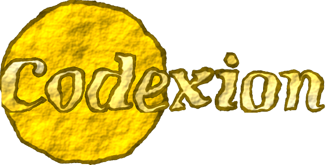

*This project was created as part of the 42 curriculum by neo.*

# Codexion



Codexion is a concurrency simulation inspired by the classical Dining Philosophers
problem, but adapted to a modern programming environment.  
Several coders share a limited number of USB dongles required to compile quantum
code. Each coder alternates between compiling, debugging and refactoring, while a
monitor thread ensures that no one burns out.

The goal of the project is to implement a safe, deadlock‑free, starvation‑free
simulation using POSIX threads, mutexes, condition variables and a fair scheduler
(FIFO or EDF).

---

## 🧩 Description

Each coder:

- Needs **two dongles** to compile.
- After compiling, enters a **debug** phase and then a **refactor** phase.
- If they wait too long before compiling again, they **burn out**.
- The simulation ends when:
  - any coder burns out, or  
  - all coders have compiled the required number of times.

The project uses:

- `pthread_create`, `pthread_mutex_t`, `pthread_cond_t`
- A **priority queue** to implement FIFO/EDF scheduling
- A **monitor thread** that detects burnout with millisecond precision
- Strict **log serialization** to avoid interleaving messages

---

## 🛠️ Instructions

### Compilation

```bash
make
